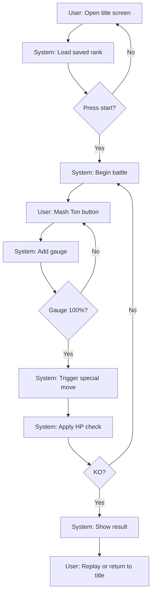
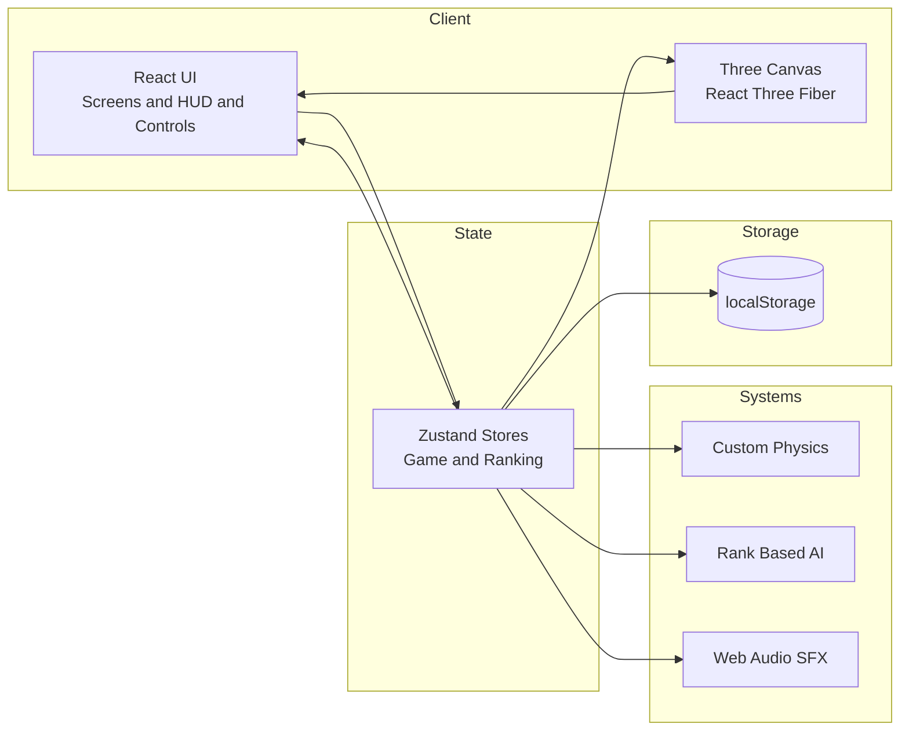

# Retro Sumo Battle

[](./README.md)
[](./README.en.md)


Retro 8-bit styled 3D sumo battle you can play in the browser.
Mash the Ton! button to charge the spirit gauge, trigger special moves, and reduce the opponent's HP.
Frontend-only app built with Vite, React, Three.js, and Zustand.

## Features

- Tap to charge the gauge; 100% triggers a special move that reduces HP
- Rank-based AI tap speed and promotion demotion logic
- Lightweight custom physics with collision and impact VFX
- 3D ring and pixel-style wrestlers (React Three Fiber)
- Procedural SFX via Web Audio API and mobile haptics

## Requirements

- Node.js (Example: 18+)
- Modern browser with WebGL and Web Audio support
- External services: none

## Installation

```bash
npm install
```

## Quick Start

1. `npm install`
2. `npm run dev`
3. Open the URL shown in the terminal (usually `http://localhost:5173`)
4. Play with the on-screen Ton button

## Usage

### Dev server

```bash
npm run dev
```

### Build and preview

```bash
npm run build
npm run preview
```

### How to play (overview)

- Start from the title screen
- Mash Ton! to charge the gauge
- At 100%, a special move triggers and reduces HP
- When the opponent's HP reaches 0, the match ends and the rank updates

## User Flow (Mermaid)



## System Architecture (Mermaid)



## Directory Structure

```
src/
  components/   # Screens, HUD, input, 3D scene
  physics/      # Physics simulation
  state/        # Zustand stores (game, ranking)
  systems/      # AI, sound, tap tracking
  styles/       # Retro UI styles
  types/        # Type definitions
  utils/        # Texture generation and helpers

docs/           # Specs and design docs
index.html      # HTML entry
package.json    # Scripts and dependencies
vite.config.ts  # Vite config
.env.example    # Environment template
vercel.json     # Vercel deploy config
```

## Configuration

- `.env.example` provides a Vite-oriented settings template.
- The app runs without environment variables by default (no references in source).

## Development

```bash
npm run lint
```

## License

MIT License. See `LICENSE`.
