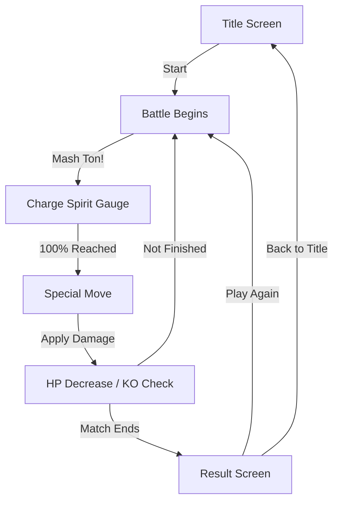
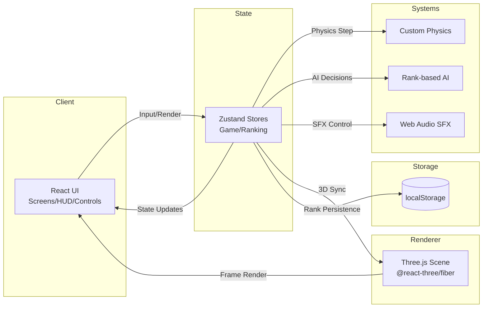
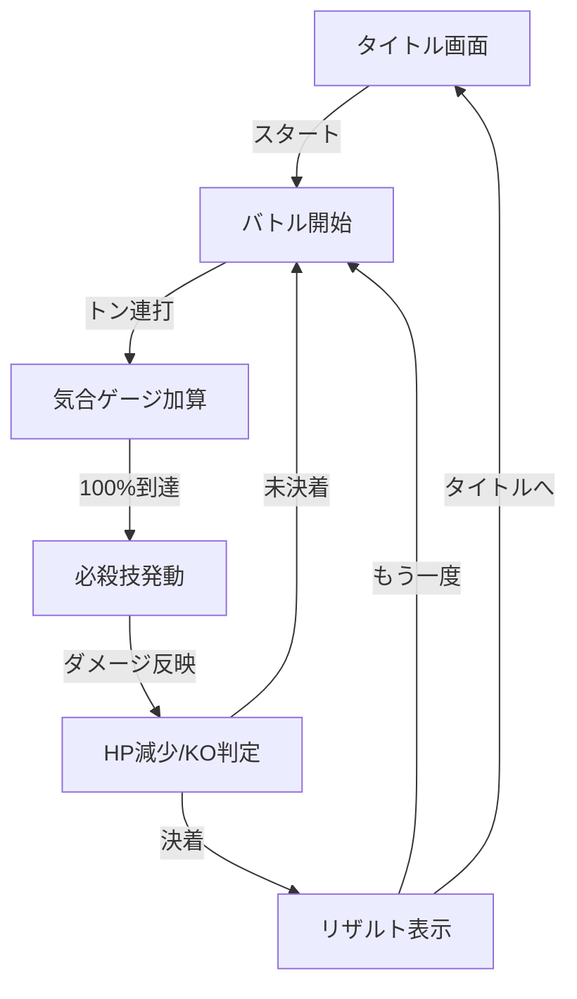
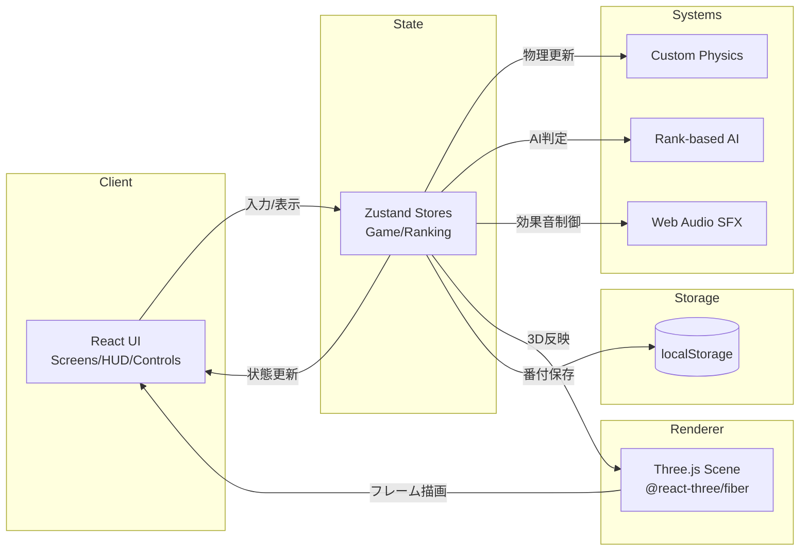

# Retro Sumo Battle (sumo-game)

[](#english)
[](#japanese)

---

<a id="english"></a>

# Retro Sumo Battle (sumo-game)


A retro 8-bit styled 3D sumo battle you can play in the browser.
Mash the "Ton!" button to build your spirit gauge, then unleash special moves to reduce the opponent's HP.
This is a front-end only project built with Vite + React + Three.js + Zustand.

## Features

- Simple tap/mash controls with a 100% gauge trigger for special moves
- Rank-based AI difficulty and automatic sumo ranking progression
- Lightweight custom physics with collision and impact effects
- 3D scene + pixel-art wrestler visuals + retro UI styling
- Procedural SFX via Web Audio API and mobile haptic feedback

## Requirements

- Node.js: version not specified (Example: 18+)
- External services: none (front-end only)

## Installation

```bash
npm install
```

## Quick Start

1. (Optional) Copy `.env.example` to `.env`
2. `npm install`
3. `npm run dev`
4. Open `http://localhost:5173`

## Usage

### Dev server

```bash
npm run dev
```

### Build & preview

```bash
npm run build
npm run preview
```

### How to play (overview)

- Start from the title screen
- Mash "Ton!" to charge the gauge
- At 100%, a special move triggers and deals HP damage
- When the opponent's HP reaches 0, the match ends and ranks update

## User Flow (Mermaid)



## System Architecture (Mermaid)



## Directory Structure

```
src/
  components/   # UI + 3D scene (screens/hud/scene/controls)
  physics/      # Physics logic
  state/        # Zustand stores (game/ranking)
  systems/      # AI, sound, tap tracking
  styles/       # Retro UI styles
  types/        # Type definitions
  utils/        # Texture generation, etc.

docs/           # Design docs
index.html      # App entry
vite.config.ts  # Vite config
vercel.json     # Vercel deploy config
.env.example    # Environment variable template
```

## Configuration

See `.env.example` for Vite env templates.

- Dev server: `VITE_PORT`, `VITE_HOST`
- Build/Deploy: `VITE_BASE_URL`, `VITE_SOURCEMAP`, `VITE_BUNDLE_ANALYZER`
- Debug: `VITE_DEBUG_MODE`, `VITE_DEBUG_PHYSICS`, `VITE_DEBUG_AI`
- Balance: `VITE_INITIAL_HP`, `VITE_GAUGE_MULTIPLIER`, `VITE_DAMAGE_MULTIPLIER`
- PWA display: `VITE_APP_NAME`, `VITE_THEME_COLOR`

## Development

```bash
npm run lint
```

## License

MIT License


---

<a id="japanese"></a>

# レトロ相撲バトル (sumo-game)


ブラウザで遊べる、レトロ8bit調の3D相撲バトル。
「トン！」連打で気合ゲージをため、必殺技で相手のHPを削るシンプル設計です。
Vite + React + Three.js + Zustand で構成されたフロントエンド単体プロジェクトです。

## Features

- 連打でゲージをためるシンプル操作（100%で必殺技）
- ランク連動のAI難易度と番付の自動昇進・降格
- カスタム軽量物理シミュレーション＋衝突/衝撃演出
- 3Dシーン + ピクセルアート風キャラクター + レトロUI
- Web Audio API による生成効果音とモバイル向け振動フィードバック

## Requirements

- Node.js: バージョン指定なし（Example: 18+）
- 外部サービス: なし（フロントエンドのみ）

## Installation

```bash
npm install
```

## Quick Start

1. （任意）`.env.example` を `.env` にコピー
2. `npm install`
3. `npm run dev`
4. ブラウザで `http://localhost:5173` を開く

## Usage

### 開発サーバー

```bash
npm run dev
```

### ビルド & プレビュー

```bash
npm run build
npm run preview
```

### ゲームの遊び方（概要）

- タイトル画面から「スタート」
- 「トン！」を連打してゲージを上げる
- ゲージ100%で必殺技が発動し、相手HPを削る
- 相手HPが0になると勝敗が決定し、番付が更新される

## User Flow (Mermaid)



## System Architecture (Mermaid)



## Directory Structure

```
src/
  components/   # UI・3Dシーン（screens/hud/scene/controls）
  physics/      # 物理演算ロジック
  state/        # Zustandストア（ゲーム/番付）
  systems/      # AI・サウンド・タップ計測など
  styles/       # レトロUIのスタイル
  types/        # 型定義
  utils/        # テクスチャ生成など

docs/           # 設計ドキュメント
index.html      # アプリエントリ
vite.config.ts  # Vite設定
vercel.json     # Vercelデプロイ設定
.env.example    # 環境変数のサンプル
```

## Configuration

`.env.example` に Vite 用の環境変数テンプレートがあります。

- 開発サーバー: `VITE_PORT`, `VITE_HOST`
- ビルド/公開: `VITE_BASE_URL`, `VITE_SOURCEMAP`, `VITE_BUNDLE_ANALYZER`
- デバッグ: `VITE_DEBUG_MODE`, `VITE_DEBUG_PHYSICS`, `VITE_DEBUG_AI`
- ゲーム調整: `VITE_INITIAL_HP`, `VITE_GAUGE_MULTIPLIER`, `VITE_DAMAGE_MULTIPLIER`
- PWA表示: `VITE_APP_NAME`, `VITE_THEME_COLOR`

## Development

```bash
npm run lint
```

## License

MIT License


