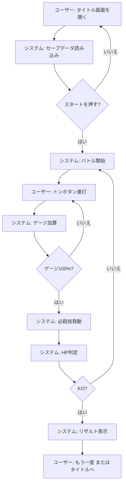
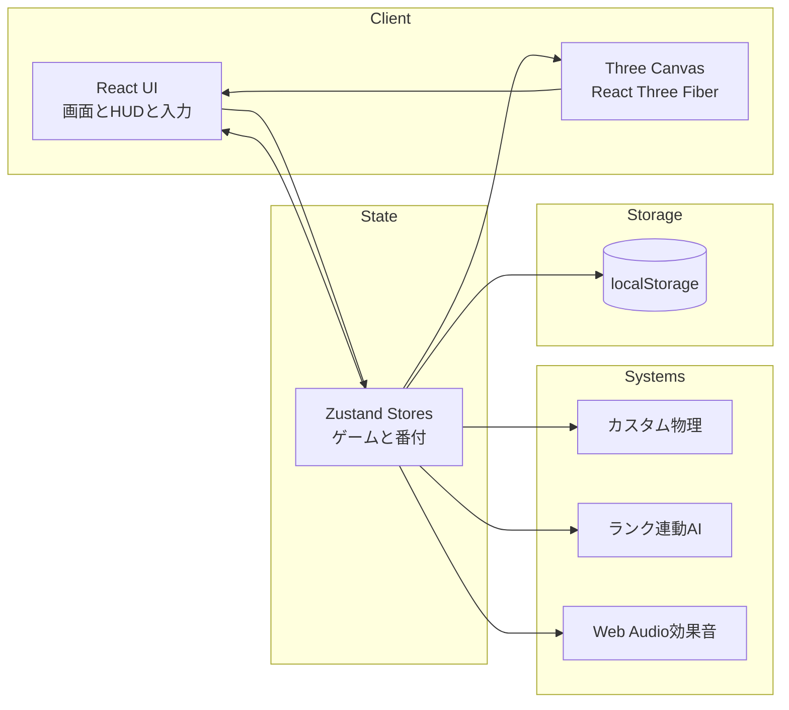

# レトロ相撲バトル

[](./README.md)
[](./README.en.md)


ブラウザで遊べるレトロ8bit調の3D相撲ゲーム。
「トン！」連打で気合ゲージをため、必殺技で相手のHPを削るタップ対戦です。
Vite + React + Three.js + Zustand のフロントエンド単体構成です。

## 特徴

- トン連打でゲージをため、100%で必殺技が発動してHPを削る
- 番付に連動したAIのタップ速度と昇進・降格ロジック
- 軽量カスタム物理と衝突・衝撃のビジュアル演出
- 3D土俵とピクセル風力士の描画（React Three Fiber）
- Web Audio APIの効果音とモバイル向け振動

## 要件

- Node.js（Example: 18+）
- WebGL と Web Audio に対応したモダンブラウザ
- 外部サービス: なし

## インストール

```bash
npm install
```

## クイックスタート

1. `npm install`
2. `npm run dev`
3. ターミナルに表示されたURL（通常 `http://localhost:5173`）を開く
4. 画面の「トン！」ボタンでプレイ

## 使い方

### 開発サーバー

```bash
npm run dev
```

### ビルドとプレビュー

```bash
npm run build
npm run preview
```

### 遊び方（概要）

- タイトル画面からスタート
- 「トン！」を連打してゲージをためる
- 100%到達で必殺技が発動し、相手のHPを削る
- 相手のHPが0になると試合終了、番付が更新される

## ユーザーフロー（Mermaid）



## システムアーキテクチャ（Mermaid）



## ディレクトリ構成

```
src/
  components/   # 画面、HUD、入力、3Dシーン
  physics/      # 物理演算ロジック
  state/        # Zustandストア（ゲーム、番付）
  systems/      # AI、サウンド、タップ計測
  styles/       # レトロUIのスタイル
  types/        # 型定義
  utils/        # テクスチャ生成など

docs/           # 仕様・設計ドキュメント
index.html      # エントリHTML
package.json    # スクリプトと依存関係
vite.config.ts  # Vite設定
.env.example    # 環境変数テンプレート
vercel.json     # Vercelデプロイ設定
```

## 設定

- `.env.example` にVite向けの設定テンプレートがあります。
- 現状は環境変数なしで動作します（ソース側で参照していません）。

## 開発

```bash
npm run lint
```

## ライセンス

MIT License. 詳細は `LICENSE` を参照してください。
