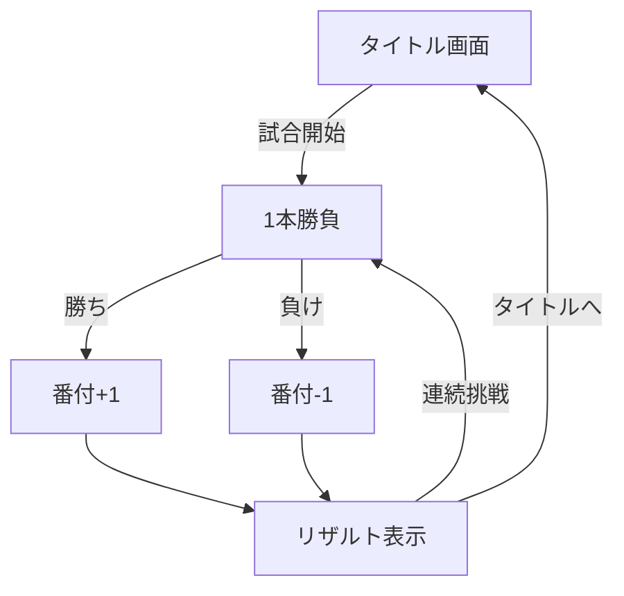

# 相撲バトルゲーム

モバイル向けのレトロ風3D相撲バトルゲーム。シンプルなタッチ操作で楽しむ、短時間の白熱バトル。

## 特徴

- **レトロデザイン**: 8bitカラーパレット、ドット絵風フォント、懐かしいゲーム感
- **シンプル操作**: タッチボタン3つだけ（押す、つっぱり、スペシャル）
- **短時間バトル**: 1ラウンド1〜2分の1本勝負
- **軽量設計**: 1.5MB以下のバンドルサイズ、Vercel最適化済み
- **快適動作**: 30fps以上（モバイル）、シンプルな3D描画

## クイックスタート

### 必要環境

- Node.js 18以上
- npm または yarn

### インストール

```bash
# リポジトリをクローン
git clone https://github.com/usagi917/sumo_game.git
cd sumo_game

# 依存関係をインストール
npm install
```

### 開発サーバー起動

```bash
npm run dev
```

ブラウザで `http://localhost:5173` を開きます。

### ビルド

```bash
npm run build
```

`dist/` ディレクトリにプロダクションビルドが生成されます。

## 操作方法

### バトル中の操作

- **押す**: 近距離で相手を押し出す
- **つっぱり**: 連打でダメージを与える
- **スペシャル**: ゲージ満タン時に使える必殺技
  - 技A: 強力な押し出し攻撃
  - 技B: 連撃バースト

### 勝利条件と番付

- 相手を土俵外に押し出す、またはHPをゼロにして1本勝負に勝利
- 勝てば番付が1段上がり、負ければ1段下がる（最低は幕下18枚目）
- 関脇で2連勝すると大関昇進、大関で3連勝すると横綱昇進

## ゲームの流れ

1. **タイトル画面** - 試合開始を選択
2. **バトル** - 1本勝負（1ラウンド）
3. **リザルト** - 勝敗に応じて番付を昇降
4. 連続挑戦して幕下18枚目から横綱を目指す



## 技術スタック

- **フロントエンド**: Vite + React + TypeScript
- **3Dレンダリング**: Three.js + @react-three/fiber（基本ジオメトリのみ使用）
- **状態管理**: Zustand
- **レトロスタイル**: CSS + ピクセルフォント（PixelMplus）
- **デプロイ**: Vercel（静的ビルド）

**設計方針**: 物理エンジン不使用、シンプルな座標計算による衝突判定

## プロジェクト構造

```
src/
├── types/             # 型定義（共有インターフェース）
│   └── index.ts       # Actor, ActionType, GameState
│
├── state/             # Zustand状態管理
│   └── store.ts       # グローバルゲームステート
│
├── game/              # ゲームロジック
│   ├── actors/        # 力士（Sumo.tsx）、土俵（Ring.tsx）
│   ├── systems/       # movement.ts, actions.ts, gauge.ts, ai.ts
│   └── GameScene.tsx  # 3Dシーン統合
│
├── ui/                # UIコンポーネント
│   ├── hud/           # HPBar、GaugeBar、HUD
│   ├── controls/      # ActionButtons
│   └── screens/       # TitleScreen、ResultScreen
│
└── styles/            # レトロスタイル
    ├── retro.css      # 8bitカラーパレット
    └── fonts.css      # ドット絵フォント
```

## 開発ガイド

### テスト実行

```bash
npm test
```

### 型チェック

```bash
npm run typecheck
```

### リント

```bash
npm run lint
```

## ドキュメント

- [アーキテクチャ設計](docs/ARCHITECTURE.md) - システム設計とモジュール構造
- [ゲームデザイン](docs/GAME_DESIGN.md) - ゲームメカニクスと仕様
- [操作仕様](docs/CONTROLS.md) - 入力システムと操作詳細

## パフォーマンス

- **目標FPS**: 30fps以上（モバイル）
- **初回ロード**: 3秒以内（Wi-Fi環境）
- **バンドルサイズ**: 1.5MB以下（物理エンジン削除により軽量化）

## ブラウザ対応

- iOS Safari 15以上
- Android Chrome 90以上
- デスクトップChrome、Firefox最新版

## ライセンス

MIT License

## 貢献

プルリクエストを歓迎します。大きな変更の場合は、まずissueを開いて変更内容を議論してください。

## MVPスコープ

このバージョンはMVP（Minimum Viable Product）として、コアバトル体験に焦点を当てています：

実装機能:
- ✅ レトロ風UIデザイン
- ✅ コアバトルシステム（押す、つっぱり、スペシャル）
- ✅ スペシャル技2種
- ✅ ゲージシステム
- ✅ HP・土俵外判定
- ✅ タイトル・リザルト画面
- ✅ シンプルAI対戦
