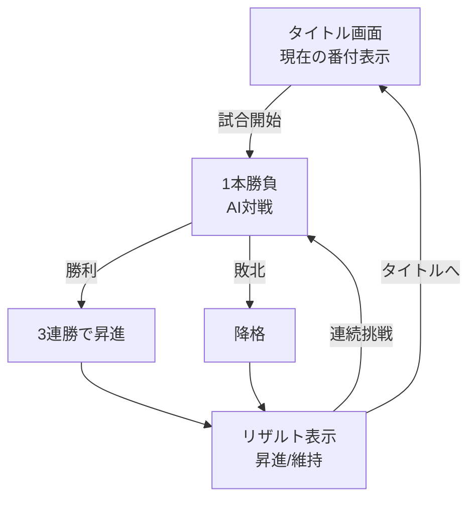

# 相撲バトルゲーム

モバイル向けのレトロ風3D相撲バトルゲーム。シンプルなタッチ操作で楽しむ、短時間の白熱バトル。

## 特徴

- **レトロデザイン**: 8bitカラーパレット、ドット絵風フォント、懐かしいゲーム感
- **シンプル操作**: 連打でトン！相手を押し出す直感的なバトル
- **番付システム**: 本格的な相撲の階級制度（前頭→小結→関脇→大関→横綱）
- **短時間バトル**: 1ラウンド1〜2分の1本勝負
- **軽量設計**: 1.5MB以下のバンドルサイズ、Vercel最適化済み
- **快適動作**: 30fps以上（モバイル）、シンプルな3D描画

## クイックスタート

### 必要環境

- Node.js 18以上
- npm または yarn

### インストール

```bash
# リポジトリをクローン
git clone https://github.com/usagi917/sumo_game.git
cd sumo_game

# 依存関係をインストール
npm install
```

### 開発サーバー起動

```bash
npm run dev
```

ブラウザで `http://localhost:5173` を開きます。

### ビルド

```bash
npm run build
```

`dist/` ディレクトリにプロダクションビルドが生成されます。

## 操作方法

### バトル中の操作

- **トン！ボタン**: ボタンを連打して相手を押し出す
  - 連打すればするほど強い力で押せる
  - タップレート（1秒あたりの回数）で押す力が変わる
  - 相手を傾けて転倒させるか、土俵外に押し出せば勝利

### 勝利条件

以下のいずれかを満たすと勝利：

- 相手を転倒させる（傾きが限界に達する）
- 相手を土俵外に押し出す（土俵中心から4.5ユニット超）

## ゲームの流れ

1. **タイトル画面** - 現在の番付と戦績を確認
2. **バトル** - AI対戦で1本勝負（1ラウンド）
3. **リザルト** - 勝敗と番付の変動を表示
4. 連続挑戦またはタイトルへ戻る



### 番付システム

**階級制度**:
- 前頭（最低）→ 小結 → 関脇 → 大関 → 横綱（最高）

**昇進・降格ルール**:
- **昇進**: 3連勝で次の階級へ昇進
- **降格**: 1敗で前の階級へ降格（前頭は降格なし）
- **横綱**: 最高位、敗北しても降格しない
- **連勝**: 敗北するとリセットされる

**戦績の保存**:
- 現在の番付と連勝数はlocalStorageに保存
- ブラウザを閉じても進捗が保持される

## 技術スタック

- **フロントエンド**: Vite + React + TypeScript
- **3Dレンダリング**: Three.js + @react-three/fiber（基本ジオメトリのみ使用）
- **状態管理**: Zustand
- **レトロスタイル**: CSS + ピクセルフォント（M PLUS 1）
- **デプロイ**: Vercel（静的ビルド）

**設計方針**: カスタム物理エンジン（重力、減衰、衝突）と連打システムによるシンプルで爽快な相撲バトル

## プロジェクト構造

```
src/
├── types/             # 型定義（共有インターフェース）
│   └── game.ts        # PhysicsState, GameState
│
├── state/             # Zustand状態管理
│   └── gameStore.ts   # グローバルゲームステート
│
├── physics/           # 物理エンジン
│   └── tontonzumo-physics.ts  # 重力、衝突、転倒判定
│
├── systems/           # ゲームシステム
│   └── tap-tracker.ts # タップレート測定
│
├── components/        # Reactコンポーネント
│   ├── game/          # Sumo.tsx（力士）、Ring.tsx（土俵）
│   │   └── GameScene.tsx  # 3Dシーン統合
│   ├── ui/            # TitleScreen、ResultScreen、TappingUI
│   └── screens/       # タイトル、リザルト画面
│
└── styles/            # レトロスタイル
    └── index.css      # 8bitカラーパレット、M PLUS 1フォント
```

## 開発ガイド

### テスト実行

```bash
npm test
```

### 型チェック

```bash
npm run typecheck
```

### リント

```bash
npm run lint
```

## ドキュメント

- [ゲームデザイン](docs/GAME_DESIGN.md) - ゲームメカニクスと仕様
- [アーキテクチャ](docs/ARCHITECTURE.md) - システム設計とモジュール構造
- [操作仕様](docs/CONTROLS.md) - 入力システムと操作詳細

## パフォーマンス

- **目標FPS**: 30fps以上（モバイル）
- **初回ロード**: 3秒以内（Wi-Fi環境）
- **バンドルサイズ**: 1.5MB以下（シンプル実装により軽量化）

## ブラウザ対応

- iOS Safari 15以上
- Android Chrome 90以上
- デスクトップChrome、Firefox最新版

## ライセンス

MIT License

## 貢献

プルリクエストを歓迎します。大きな変更の場合は、まずissueを開いて変更内容を議論してください。
